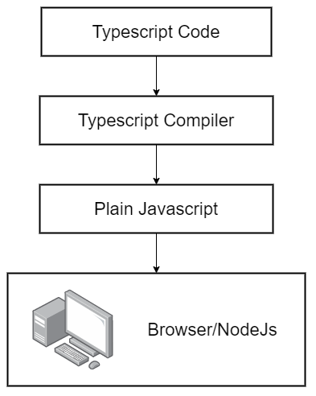

# Javascript with Typescript

- [Javascript with Typescript](#javascript-with-typescript)
  - [Introduction](#introduction)
  - [Local Environment Setup](#local-environment-setup)
  - [How to use the compiler](#how-to-use-the-compiler)
  - [Basic Types](#basic-types)
    - [Types in typescript](#types-in-typescript)
  - [Type Annotations and Type Inference](#type-annotations-and-type-inference)
    - [Type Annotations](#type-annotations)
      - [Variables](#variables)
      - [Functions](#functions)
    - [Type Inference](#type-inference)
  - [Arrays](#arrays)
  - [Interfaces](#interfaces)
  - [Classes](#classes)
    - [Access Modifiers](#access-modifiers)

## Introduction

TypeScript extends JavaScript by adding types.

By understanding JavaScript, TypeScript saves you time catching errors and providing fixes before you run code.

TypeScript is an open-source language which builds on JavaScript, one of the world’s most used tools, by adding static type definitions.

```text
Typescript = Javascript + Type System
```

Types provide a way to describe the shape of an object, providing better documentation, and allowing TypeScript to validate that your code is working correctly.



We can see the compiler in action by using the official online playground:
[Typescript Playground](https://www.typescriptlang.org/play/)

## Local Environment Setup

We will be installing two packages globally:

- [typescript](https://github.com/Microsoft/TypeScript)

- [ts-node](https://github.com/TypeStrong/ts-node)

```shell
npm install -g typescript ts-node
```

> ts-node is a temporary package so that we dont have to setup complete typescript tooling to run typescript files.

The typescript package gives us access to `tsc` application. To check if typescript has been successfully installed, we can execute

```shell
tsc --help
```

If the above command gives an error then typescript was not successfully installed else we can start compiling `.ts` files.

## How to use the compiler

1. Create a `.ts` file containing some typescript code in it.

2. Compile this `.ts` file using the command
   
   ```shell
   tsc <file-name>.ts
   ```
   
   This will compile a `.js` file in the same directory as the `.ts` file with the same name.

3. This `.js` file can then be executed using `node <file-name>.js`

> To ease the process of compiling using `tsc` and executing using `node` the ts-node package compiles and executes the output from a `.ts` file. ts-node can be used by running the following command:
> 
> ```shell
> ts-node <file-name>.ts
> ```
> 
> If using `ts-node` step 2 and 3 can be done using a single command.

---

## Basic Types

The Type System represents the different types of values supported by the language. The Type System checks the validity of the supplied values, before they are stored or manipulated by the program. This ensures that the code behaves as expected.

### Types in typescript

Typescript has two categories of types:

- Primitive Types
  
  - number
  
  - string
  
  - boolean
  
  - symbol
  
  - void
  
  - null
  
  - undefined

- Object Types
  
  - functions
  
  - classes
  
  - arrays
  
  - objects

## Type Annotations and Type Inference

### Type Annotations

Type Annotations are annotations that can be placed anywhere you use a type. Here, the developer decides the type to be used.

#### Variables

We assign the type to the variable by adding `:type` after the variable name. So typescript knows that the value that will be assigned to the variable will be of that type only and will throw an error if a value of different type is assigned to it.

```typescript
// Built in types
const count: number = 5;
const name: string = 'Jon Doe';
const checked: boolean = true;
const nothing: null = null;

// Built in objets
const now: Date = new Date();
```

For array types we use `type[]` as the annotation to tell typescript that we will assign an array having items of that type.

```typescript
// Array
const fruits: string[] = ['apple', 'orange', 'banana'];
```

For classes, the annotation will be of the class name itself.

```typescript
// Classes
class Car {}

const car: Car = new Car();
```

For objects, we use an object annotation having the property names and their types.

```typescript
// Object literal
const point: { x: number; y: number } = {
    x: 10,
    y: 10,
};
```

Object destructuring should have the annotation in the same format it is present in the object itself.

```typescript
const user = {
    name: 'Jon Doe',
    age: 60,
    address: {
        street: 'Some street',
        zipcode: '2021',
    },
    setAge(age: number): void {
        this.age = age;
    },
};

// Destructuring the age property
const { age }: { age: number } = user;
// Destructuring sub object
const {
    address: { street, zipcode },
}: { address: { street: string; zipcode: string } } = user;
```

In a rare scenario, we would need annotation of multiple types. We can use the or operator `|` to assign multiple possible types.

```typescript
let multiple: boolean | string = false;
multiple = 'Jon Doe';
```

#### Functions

For functions, the type annotation is assigned by providing a function type annotation having the argument type and the output type `(arg: type) => return_type` following by the actual function after the `=` sign. We can also annotate by giving the return type right after the arguments.

```typescript
const print: (message: string) => void = (message: string) => {
    console.log(message);
};

// A shorter way of writing this is
const add = (a: number, b: number): number => {
    return a + b;
};
```

To destructure an object argument, we can destructure and provide an object type annotation.

```typescript
const add = ({
    number1,
    number2,
}: {
    number1: number;
    number2: number;
}): number => {
    return number1 + number2;
};
```

### Type Inference

Type inference is the ability to automatically deduce, either partially or fully, the type of an expression at compile time. Here, typescript guesses the type.

```typescript
const count = 5; // inferred as number
const name = 'Jon Doe'; // inferred as string
const checked = true; // inferred as boolean
const nothing = null; // inferred as null
```

If the declaration and initialization is done in the same line then typescript automatically detects the type from the type of the initalized value.

If value is not initialized, typescript uses `any` as the default type.

```typescript
const count; // inferred as any

// Annotation can also be used without initialization
const count: number;
```

The `any` type is a dangerous type annotation as it allows any type of value to be assigned to the variable without throwing an error. It is recommended to avoid at whenever possible.

Type inference for functions works only for the return value type.

> Ideally, type inference can be used **always** as it is unecessary to assign type annotations separately.
> 
> Type annotation is recommended in the following scenarios:
> 
> - When a function returns `any` type and we need to specify the value type
> 
> - When variable is declared in one line and we have to initialize it later.
> 
> - When we want a variable to have a type that can't be inferred

---

## Arrays

A typed array is an array where all elements are of a consistent type of value.

```typescript
// To specifically assign a type we can always annotate the type
const fruits: string[] = ['apple', 'orange', 'banana'];
// Fruits is automatically inferred as a string type array
const fruits = ['apple', 'orange', 'banana'];
// If not type is added and value is not initialized, any type is assigned
const fruits = [];
// Type inference works accordingly when extracting values
// Here type of string is assigned to fruit
const fruit = fruits[0];
```

For multi-dimensional arrays, we add `[]` as required

```typescript
const fruits: string[][] = [
    ['apple', 'orange'],
    ['banana', 'pineapple'],
];
```

Type allows us to detect errors when adding values of other types to a typed array.

To have multiple types in an array, we can use the `|` operator.

Arrays are generally used for a collection of records. This is important because there is another type of data structure called `tuples` which are similar to arrays.

Tuples are array-like structure where each element represent some property of a record. The values need to be in a specific order to make sense when working with multiple tuples. Comparing it to an object, there is a loss of information due to the unavailability of property names. There is still specific use-case scenarios of tuples.

```typescript
const user: [string, number, boolean] = ['Jon Doe', 23, true];
```

> Tuples are generally avoided as there is no information and readability of the actual members of the set. We use objects instead and use they key to define the meaning of the value assigned.

---

## Interfaces

Interfaces are used to define an object structure. It creates a new type that describes the names of properties and their value types.

```typescript
interface User {
    name: string;
    age: number;
    joinDate: Date;
    verified: boolean;
}

const admin = {
    name: 'Jon Doe',
    age: 23,
    joinDate: new Date(),
    verified: true,
};

const printUserName = (user: User): void => {
    console.log(user.name);
};
```

To add functions as members of the object, we add the function and the return type to the interface.

```typescript
interface User {
    name: string;
    age: number;
    verified: boolean;
    getFirstName(): string;
}

const admin = {
    name: 'Jon Doe',
    age: 23,
    verified: true,
    getFirstName(): string {
        return this.name.split(' ')[0];
    },
};
```

When typescript checks for an interface it does not check for extra properties. This means the interface can be used to define different object following a similar structure

```typescript
interface Nameable {
    name: string;
}

const admin = {
    name: 'Jon Doe',
    age: 23,
    joinDate: new Date(),
    verified: true,
};

const item = {
    name: 'Soda',
};

const printName = (entity: Nameable): void => {
    console.log(entity.name);
};

printName(admin);
printName(item); // Notice how we can reuse the same function to print the name of the item as well.
```

Interfaces will generally be used to create functions that accept arguments that are typed interfaces. They can also be used with classes to implement a given interface to work with functions.

---

## Classes

A class in terms of OOP is a blueprint for creating objects. A class encapsulates data for the object. Typescript gives built in support for this concept called class. Typescript (and Javascript) gets this feature from ES6.

```typescript
class Character {
    speed: number;

    constructor(speed: number) {
        this.speed = speed;
    }

    walk(): void {
        // Walking code here
    }

    run(): void {
        // Running code here
    }
}
```

This class can be instantiated using the `new` keyword

```typescript
const player = new Character(10);
player.walk();
```

To inherit from a defined class, we can use `extends` keyword. We can then override or add more functions to the new class.

```typescript
class Enemy extends Character {
    walk(): void {
        // New walk code
    }

    shoot(): void {
        // Shoot code here
    }
}

const enemy = new Enemy();
enemy.walk();
enemy.shoot();
```

### Access Modifiers

The encapsulation concept of object oriented programming is applied in typescript by using access modifiers.

```typescript
class Character {
    protected walk(): void {
        // Walking code here
    }

    private run(): void {
        // Running code here
    }
}

class Enemy extends Character {
    walkAndRun(): void {
        this.walk(); // Will work as the class is extended from Character
        this.run(); // Will give an error because its private in parent Class
    }

    private shoot(): void {
        // Shoot code here
    }
}

const enemy = new Enemy();
enemy.shoot(); // Will give an error because its private
```

Like all oop language, typescript also has three acces modifiers:

- `public` - These methods and fields of the class can be called from anywhere. **This is the default modifier if not specified**

- `private` - These methods and fields can only be called by other methods in the same class

- `protected` - These methods and fields can be called by other methods in the same class or by other methods in its child classes

A short way of using a constructor to define fields in a class is to add the modifier to the arguments.

```typescript
class Character {
    constructor(public speed: number) {}
}
```

When a child class has a constructor, we need to call the `super()` method with appropriate arguments to call the constructor of the parent.

```typescript
class Character {
    constructor(public speed: number) {}
}

class Enemy extends Character {
    constructor(public damage: number) {
        super(10); // Calling constructor of the parent class
    }
}
```

The combination of classes with types gives us the ability to write code with reusability.

---

| Sources                                                                                                      |
| ------------------------------------------------------------------------------------------------------------ |
| [Official Typescript Handbook](https://www.typescriptlang.org/docs/handbook)                                 |
| [Typescript by Stephen Grider](https://www.udemy.com/course/react-and-typescript-build-a-portfolio-project/) |
